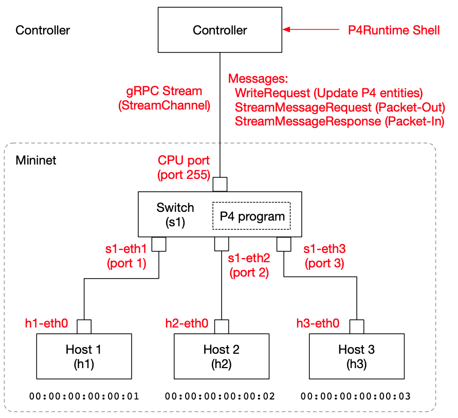

## Tutorial 0: 実験環境の準備

各 Tutorial にはコンパイルして作成した p4info.txt ファイルなどが含まれています。もし自分で P4 スイッチプログラムをコンパイルする場合は、以下のように P4Runtime 対応のオプションを与えて下さい。

```bash
root@f53fc79201b8:/tmp# p4c --target bmv2 --arch v1model --p4runtime-files p4info.txt nanosw01.p4 
root@f53fc79201b8:/tmp# ls
nanosw01.json  nanosw01.p4  nanosw01.p4i  p4info.txt
root@f53fc79201b8:/tmp# 
```

ここで生成した p4info.txt と nanosw01.json を使って、あとで P4Runtime Shell を起動することになります。

### スイッチの準備（Mininet 環境の立ち上げ）

#### システム構成

今回実験する環境のシステム構成を示します。



#### Mininet 環境の立ち上げ

ここでは [P4Runtime-enabled Mininet Docker Image](https://hub.docker.com/repository/docker/yutakayasuda/p4mn) をスイッチとして利用します。以下のようにして起動すると良いでしょう。

P4Runtimeに対応した Mininet 環境を、Docker環境で起動します。起動時に --arp と --mac オプションを指定して、ARP 処理無しに ping テストなどができるようにしてあることに注意してください。

```bash
$ docker run --privileged --rm -it -p 50001:50001 -e IPV6=false yutakayasuda/p4mn --arp --topo single,3 --mac
(snip...)
*** Starting CLI:
mininet> 
```
s1 の port 1 が h1 に、port 2 が h2に、port 3 が h3 に接続されていることが確認できます。
```bash
mininet> net
h1 h1-eth0:s1-eth1
h2 h2-eth0:s1-eth2
h3 h3-eth0:s1-eth3
s1 lo:  s1-eth1:h1-eth0 s1-eth2:h2-eth0 s1-eth3:h3-eth0
mininet> 
```
h1 がスイッチにつながれているインタフェイス h1-eth0 の MAC アドレスは  00:00:00:00:00:01です。同様に h2 が 00:00:00:00:00:02、h3 が 00:00:00:00:00:03 です。

### P4Runtime Shell と Mininet の接続

今後、ホストの /tmp/P4runtime-nanoswitch ディレクトリと docker の /tmp を同期させて実験します。そのためのディレクトリを作り、チュートリアルの各ステップごとのファイルを置いておきましょう。

```bash
$ mkdir /tmp/P4runtime-nanoswitch
$ cp -rp nanosw0* /tmp/P4runtime-nanoswitch
$ ls /tmp/P4runtime-nanoswitch
nanosw01	nanosw02	nanosw03	nanosw04	nanosw05	nanosw06
$ 
```

この状態で以下のようにして P4 Runtime Shell を起動します。これは nanosw01 チュートリアルを試す場合です。IPアドレスは自身の環境に合わせて下さい。

```bash
$ docker run --platform=linux/amd64 -ti -v /tmp/P4runtime-nanoswitch:/tmp p4lang/p4runtime-sh --grpc-addr 192.168.1.2:50001 --device-id 1 --election-id 0,1 --config /tmp/nanosw01/p4info.txt,/tmp/nanosw01/nanosw01.json
*** Welcome to the IPython shell for P4Runtime ***
P4Runtime sh >>>
```
以下のように tables など簡単なコマンドが動作することで、Mininet と正しく接続できていることを確認してください。

```bash
P4Runtime sh >>> tables
MyIngress.l2_match_table

P4Runtime sh >>>
```

これで準備は完了です。

**ARM Mac 版での注意 : ** Arm 版 Mac で P4 Runtime Shell を動作させるためには、現時点では Rosetta を有効にする必要があります。Dockerhub の設定>>General>>Virtual Machine Options にある「Use Rosetta for x86_64/amd64 emulation on Apple Silicon」にチェックを入れてください。その上で docker コマンドに対して ```$ docker run --platform=linux/amd64 ...``` のように platform オプションを加えてやると良いでしょう。

## Next Step

#### Tutorial 1: [NanoSwitch01](t1_nanosw01.md)

