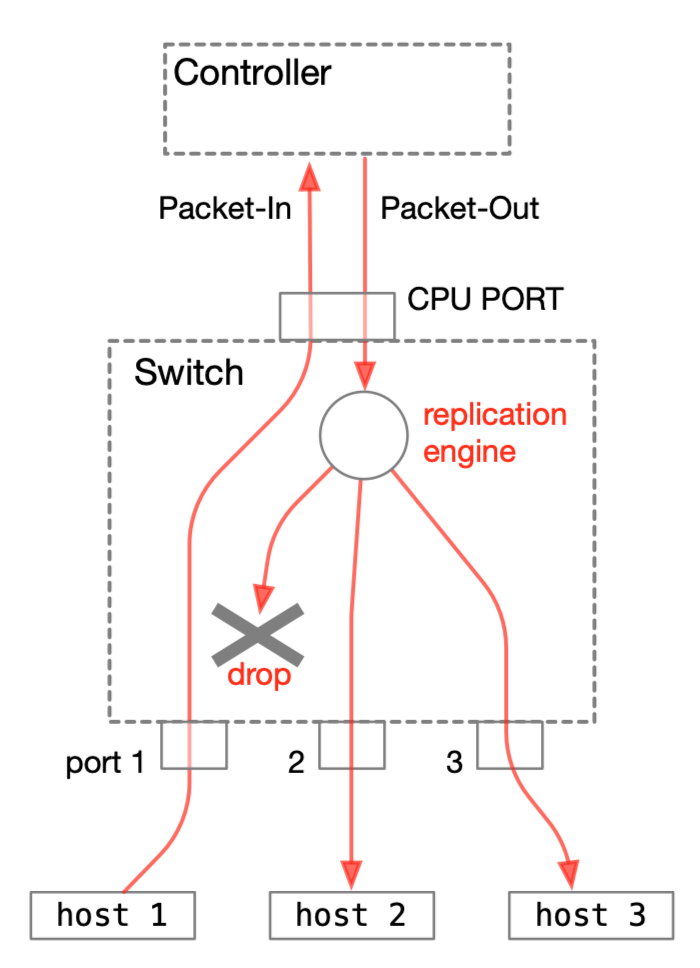

## Tutorial 3: NanoSwitch03

今回試すスイッチは、スイッチ側にフロー・テーブルを作って未知のホストに対応します。フロー・テーブルにエントリを登録する処理のために、コントローラ（P4Runtime Shell）に少し機能を追加します。

### 実験

#### P4Runtime Shell 側操作

一旦 P4Runtime Shell の実行を終わり、機能追加された shell.py と置き換えます。

```python
P4Runtime sh >>> exit
(venv) root@f4f19294589c:/tmp/nanosw02# cd ../nanosw03
(venv) root@f4f19294589c:/tmp/nanosw03# cp shell.py /p4runtime-sh/p4runtime_sh/shell.py 
(venv) root@f4f19294589c:/tmp/nanosw03# 
```

スイッチプログラムを nanosw03 に切り替えて再実行し、PacketIn() 関数を呼び出して下さい。
```python
(venv) root@f4f19294589c:/tmp/nanosw03# /p4runtime-sh/p4runtime-sh --grpc-addr 192.168.XX.XX:50001 --device-id 1 --election-id 0,1 --config p4info.txt,nanosw03.json
*** Welcome to the IPython shell for P4Runtime ***
P4Runtime sh >>> PacketIn()

......
```

#### Mininet 側操作

ここで再び ping 要求を送ると、先ほど同様に ping 応答が帰ってくることが確認できます。
```bash
mininet> h1 ping -c 1 h2       <<<<<< h1 から h2 への ping を一回だけ送る
PING 10.0.0.2 (10.0.0.2) 56(84) bytes of data.
64 bytes from 10.0.0.2: icmp_seq=1 ttl=64 time=6.23 ms

--- 10.0.0.2 ping statistics ---
1 packets transmitted, 1 received, 0% packet loss, time 0ms
rtt min/avg/max/mdev = 6.233/6.233/6.233/0.000 ms
mininet> 
```

以下に各ポートのモニタリング結果を示します。これもまた無駄なパケットの折り返しが抑制されていることが分かります。

#####  h1 (s1-eth1)

```bash
12:30:55.734450 IP 10.0.0.1 > 10.0.0.2: ICMP echo request, id 129, seq 1, length 64
12:30:55.740638 IP 10.0.0.2 > 10.0.0.1: ICMP echo reply, id 129, seq 1, length 64
```

##### h2 (s1-eth2)

```bash
12:30:55.738186 IP 10.0.0.1 > 10.0.0.2: ICMP echo request, id 129, seq 1, length 64
12:30:55.738210 IP 10.0.0.2 > 10.0.0.1: ICMP echo reply, id 129, seq 1, length 64
```

##### h3 (s1-eth3)

```bash
12:30:55.738150 IP 10.0.0.1 > 10.0.0.2: ICMP echo request, id 129, seq 1, length 64
12:30:55.740679 IP 10.0.0.2 > 10.0.0.1: ICMP echo reply, id 129, seq 1, length 64
```

#### P4 RuntimeShell 側画面

このとき、以下のような表示が出ていることが確認できます。往復した二つのパケットがどちらも Packet-In 処理されていることが分かります。

```bash
P4Runtime sh >>> PacketIn()
........
======              <<<< 一つ目のパケットの処理
packet-in: dst=00:00:00:00:00:02 src=00:00:00:00:00:01 port=b'\x00\x01'
.
======              <<<< 二つ目のパケットの処理
packet-in: dst=00:00:00:00:00:01 src=00:00:00:00:00:02 port=b'\x00\x02'
..
......^C  <<<< Control-C で中断
```

次にこの実験でのパケットの動きについて説明します。

### パケットの動き

#### 概略

このスイッチは受け取ったパケットをすべてコントローラ経由で他のポートにフラッディングします。下の図は host 1 が出したパケットが、コントローラ経由で host 2, host 3 に送られるようすを示したものです。



少し詳しく説明します。

1. host 1 が出したパケットはコントローラに向けた Packet-In として出力する
2. コントローラはこれにMulticastGroup id 1 を設定して、Packet-Out する
3. スイッチはCPU_PORTからこれを受け取り、Multicastとして複製し、出力する
4. ただし元々の入力ポート（port 1）と同じポートに出力することになったパケットはドロップする

この動きを実現するために、nanosw03.p4 に幾つかの修正を加えました。パケットの流れに沿って説明します。

#### Processing performed to Packet-In

l2_match_table テーブルの default_action は to_controller であり、現在のところフローテーブルは空なので、すべてのパケットが Controller に Packet-In されることになります。flooding action は使用しません。

```C++
    action to_controller() {
        standard_metadata.egress_spec = CPU_PORT;
        hdr.packet_in.setValid();
        hdr.packet_in.ingress_port = standard_metadata.ingress_port;
    }
    table l2_match_table {
        key = {
            hdr.ethernet.dstAddr: exact;
            hdr.ethernet.srcAddr: exact;
        }
        actions = {
            forward;
            to_controller;
            // flooding;
        }
        size = 1024;
        default_action = to_controller;
    }
```
この Packet-In 処理は先ほど置き換えた shell.py の中に実装されています。以下に主要な部分だけ抜粋して示します。
```Python
def packetin_process(pin):
    payload = pin.packet.payload
    port = pin.packet.metadata[0].value   # original ingres_port
    mcast_grp = b'\x00\x01'   # caution, hardcoded multicast group
    payload = pin.packet.payload
    PacketOut(port, mcast_grp, payload)
    
def PacketIn():
        while True:
            rep = client.get_stream_packet("packet", timeout=1)
            if rep is not None:
                packetin_process(rep)
```

つまりPacketIn() 関数が StreamMessage Response を待ち受け、受信すると受け取った Packet-In パケットを引数に与えて、packetin_process() 関数を呼び出します。packetin_process() 関数は無条件に受け取ったパケットに、Multicast Group の情報(1) と、元の Ingress_port の情報をつけてPacketOut() 関数に渡します。

#### Packet-Out に関連する動き

以下に packet_out ヘッダと PacketOut() 関数の実装を示します。packet_out ヘッダにはMulticast Groupの情報が追加されています。

```C++
@controller_header("packet_out")
header packet_out_header_t {
    bit<9> egress_port;
    bit<7> _pad;
    bit<16> mcast_grp; 
}
```

```python
def PacketOut(port, mcast_grp, payload):
    req = p4runtime_pb2.StreamMessageRequest()
    packet = req.packet
    packet.payload = payload

    metadata = p4runtime_pb2.PacketMetadata()
    metadata.metadata_id = 1   <<<<< egress_port
    metadata.value = port
    packet.metadata.append(metadata)
    metadata.metadata_id = 3   <<<<< mcast_id
    metadata.value = mcast_grp
    packet.metadata.append(metadata)

    client.stream_out_q.put(req)
```

この PacketOut() 関数は、とても単純に packet_out ヘッダをセットしてスイッチに送り出すだけのものです。

#### 受信したスイッチ側でのIngress処理

スイッチ側はこの追加された packet_out ヘッダ、つまり mcat_grp に反応するために、nanosw03.p4 側の Packet-Out 処理を修正しています。
元は以下のような記述でした。つまり Packet-Out （CPU_PORT から来たパケット）だったら、そこに指定された packet_out.egress_port に出力するだけのものです。

```C++
            standard_metadata.egress_spec = hdr.packet_out.egress_port;
            hdr.packet_out.setInvalid();
```
ここを以下のように書き換えています。
```C++
            if (hdr.packet_out.mcast_grp == 0) { // packet out to specified port
                standard_metadata.egress_spec = hdr.packet_out.egress_port;
            } else { // broadcast to all port, or flood except specified port
                standard_metadata.mcast_grp = hdr.packet_out.mcast_grp; // set multicast flag
                meta.ingress_port = hdr.packet_out.egress_port; // store exception port
            }
```

このために以下のようにユーザメタデータを用意しています。

```C
struct metadata {
    bit<9> ingress_port;
    bit<7> _pad;
}
```

つまり、

- もし Packet-Out にMulticast Groupの指定がない (0) なら、
  - 出力先は packet_out.egress_port となる
- もしMulticast Groupの指定があれば、
  -  マルチキャストの出力先としてそこを指定し、
  - ユーザメタデータである meta.ingress_port に、出力をドロップする対象となるポートの情報（packet_out.egress_port）を記録する

特に最後の処理は重要かつ、いくらかトリッキーなものになっています。（ごめんなさい。フィールドを節約したかったんです。動作を確認したい人は下の補足を読んで下さい。）

この結果、パケットは Replication Enigne によってすべてのポートに複製され、それぞれに対してEgress処理が行われます。

#### スイッチ側でのEgress処理

Egress 処理は簡単です。出力先が上で設定した除外ポートであれば、単に出力せずドロップします。それ以外のものはそのまま出力されます。

```C
        if(meta.ingress_port == standard_metadata.egress_port) {
            mark_to_drop(standard_metadata);
        }
```


## ふぅ。

この Tutorial では、Packet-In/Out を介したコントローラとの協調作業を試しました。もちろんこんなことをしていてはスイッチとしてまったく性能が出ません。次の Tutorial では、ちゃんとホストに対応するフロー・エントリを追加し、コントローラを介さないパケットの交換を実現するスイッチを作ります。


### 補足：Packet-Out処理の実験

上に書いたように、このスイッチのPacket-Out 処理に対するMulticast Group と egress_port の設定はいくらかトリッキーです。

- port 3 に出力するためには、以下のようにする
  - hdr.packet_out.egress_port を 3 にする
  - hdr.packet_out.mcast_grp を 0 にする（初期値が 0 ）
- port 3 以外に出力する（Floodingする）ためには、以下のようにする
  - hdr.packet_out.egress_port を 3 にする
  - hdr.packet_out.mcast_grp を 1 にする

実際に挙動を確認すると分かりやすいかもしれません。以下に方法を示します。

#### port 3 に出力する Unicast 指定

packetout3.txt に、port 3 にのみ出力するための Stream Message Request を作りました。以下のように Request() 関数を使ってスイッチに送り込むことができます。

```bash
P4Runtime sh >>> Request("/tmp/packetout3.txt")
packet {
  payload: "\377\377\377\377\377\377\377\377\377\377\377\377\000\0001234567890123456789012345678901234567890123456789012345678901234567890123456789"
  metadata {
    metadata_id: 1    <<<<< egress_port
    value: "\000\003"
  }
  metadata {
    metadata_id: 3    <<<<< mcast_id
    value: "\000\000"
  }
}
```

Mininet の各ポートをモニタリングしておけば、 port 3 (s1-eth3) にだけパケットが検出される事がわかるでしょう。

#### port 3 以外のすべてのポートに出力する Multicast 指定

packetout3else.txt に、port 3 以外のすべてのポートに出力するための Stream Message Request を作りました。以下のように Request() 関数を使ってスイッチに送り込むことができます。

```bash
P4Runtime sh >>> Request("/tmp/packetout3else.txt")                                                                                            
packet {
  payload: "\377\377\377\377\377\377\377\377\377\377\377\377\000\0001234567890123456789012345678901234567890123456789012345678901234567890123456789"
  metadata {
    metadata_id: 1    <<<<< egress_port
    value: "\000\003"
  }
  metadata {
    metadata_id: 3    <<<<< mcast_id
    value: "\000\001"
  }
}
```

Mininet の各ポートをモニタリングしておけば、 port 3 (s1-eth3) 以外のポートにパケットが検出される事がわかるでしょう。

#### 

## Next Step

#### Tutorial 4: [NanoSwitch04](t4_nanosw04.md)

