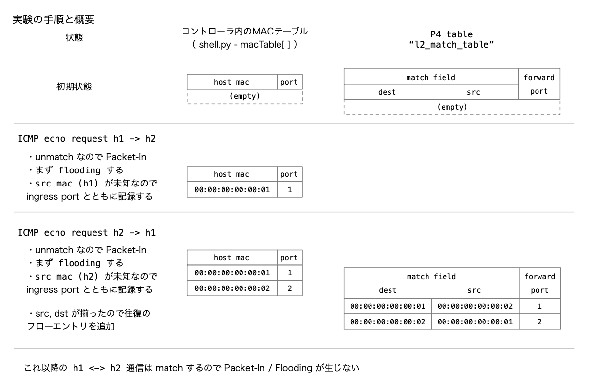

## Tutorial 4: NanoSwitch04

コントローラ側にホスト・テーブルを作って既知のホストに対応します。つまり既知のホスト・ペアの通信についてはフローテーブルに往復ぶんのエントリを追加します。それ以降はコントローラを介さず、スイッチだけで往復パケットの転送が行われます。

###  ショートカットしてここから始める人のために

このテストのためには、以下の作業が必要です。

1. P4Runtime Shell の起動と Mininet への接続 - see; Tutorial 0: [実験環境の準備](./t0_prepare.md)
2. Multicast Group の設定 - see; Tutorial 1: [NanoSwitch01](./t1_nanosw01.md)
   それがないとFloodingが行われません。そして（目に見える）エラーも発生しないため、何故動かないのか分からなくなります。

### 実験

#### P4Runtime Shell 側操作

今回はスイッチプログラムに変更はなく、同じ nanosw03 スイッチプログラムを使いますが、tutorial.py は nanosw04 ディレクトリにあるものを使います。

まず一旦 P4Runtime Shell の実行を終わり、nanosw04 以下にある nanosw03 スイッチプログラムを使って P4Runtime Shell を再起動してください。

```python
P4Runtime sh >>> exit
$ docker run --platform=linux/amd64 -ti -v /tmp/P4runtime-nanoswitch:/tmp p4lang/p4runtime-sh --grpc-addr 192.168.1.2:50001 --device-id 1 --election-id 0,1 --config /tmp/nanosw04/p4info.txt,/tmp/nanosw04/nanosw03.json
*** Welcome to the IPython shell for P4Runtime ***
P4Runtime sh >>>
```

その後、以下のようにして /tmp/nanosw04 以下にある tutorial.py にあるコントローラプログラムを起動します。

```python
P4Runtime sh >>> import sys

P4Runtime sh >>> sys.path.append "/tmp/nanosw04"

P4Runtime sh >>> import tutorial

P4Runtime sh >>> tutorial.controller_daemon(packet_in, tutorial.my_packetin)
```

#### Mininet 側操作

ここで再び ping 要求を送ると、先ほど同様に ping 応答が帰ってくることが確認できます。

```bash
mininet> h1 ping h2
PING 10.0.0.2 (10.0.0.2) 56(84) bytes of data.
64 bytes from 10.0.0.2: icmp_seq=1 ttl=64 time=8.38 ms
64 bytes from 10.0.0.2: icmp_seq=2 ttl=64 time=0.701 ms
64 bytes from 10.0.0.2: icmp_seq=3 ttl=64 time=0.778 ms
64 bytes from 10.0.0.2: icmp_seq=4 ttl=64 time=1.13 ms
^C
--- 10.0.0.2 ping statistics ---
4 packets transmitted, 4 received, 0% packet loss, time 3055ms
rtt min/avg/max/mdev = 0.535/0.772/1.114/0.221 ms
mininet> 
```
#### P4 RuntimeShell 側画面
このとき、以下のような表示が出ていることが確認できます。最初の二つのパケットまでが Packet-In でコントローラに戻されており、二つ目の Packet-In 処理でフロー・エントリが設定されて以降はコントローラに Packet-In されることがなくなっています。
```bash
P4Runtime sh >>> tutorial.controller_daemon(packet_in, tutorial.my_packetin)

packet-in: dst=00:00:00:00:00:02 src=00:00:00:00:00:01 port=1
send 
 payload: "\\x00\\x00\\x00\\x00\\x00\\x02\\x00\\x00\\x00\\x00\\x00\\x01\\x08\\x00\\x45\\x00\\x00\\x54\\x45\\x25\\x40\\x00\\x40\\x01\\xe1\\x81\\x0a\\x00\\x00\\x01\\x0a\\x00\\x00\\x02\\x08\\x00\\x93\\xe7\\x00\\xa6\\x00\\x01\\x14\\x82\\xe1\\x69\\x00\\x00\\x00\\x00\\xa6\\xb2\\x08\\x00\\x00\\x00\\x00\\x00\\x10\\x11\\x12\\x13\\x14\\x15\\x16\\x17\\x18\\x19\\x1a\\x1b\\x1c\\x1d\\x1e\\x1f\\x20\\x21\\x22\\x23\\x24\\x25\\x26\\x27\\x28\\x29\\x2a\\x2b\\x2c\\x2d\\x2e\\x2f\\x30\\x31\\x32\\x33\\x34\\x35\\x36\\x37"
metadata {
  metadata_id: 1 ("egress_port")
  value: "\\x00\\x01"
}
metadata {
  metadata_id: 2 ("_pad")
  value: "\\x00"
}
metadata {
  metadata_id: 3 ("mcast_grp")
  value: "\\x00\\x01"
}


packet-in: dst=00:00:00:00:00:01 src=00:00:00:00:00:02 port=2
send 
 payload: "\\x00\\x00\\x00\\x00\\x00\\x01\\x00\\x00\\x00\\x00\\x00\\x02\\x08\\x00\\x45\\x00\\x00\\x54\\x2e\\x29\\x00\\x00\\x40\\x01\\x38\\x7e\\x0a\\x00\\x00\\x02\\x0a\\x00\\x00\\x01\\x00\\x00\\x9b\\xe7\\x00\\xa6\\x00\\x01\\x14\\x82\\xe1\\x69\\x00\\x00\\x00\\x00\\xa6\\xb2\\x08\\x00\\x00\\x00\\x00\\x00\\x10\\x11\\x12\\x13\\x14\\x15\\x16\\x17\\x18\\x19\\x1a\\x1b\\x1c\\x1d\\x1e\\x1f\\x20\\x21\\x22\\x23\\x24\\x25\\x26\\x27\\x28\\x29\\x2a\\x2b\\x2c\\x2d\\x2e\\x2f\\x30\\x31\\x32\\x33\\x34\\x35\\x36\\x37"
metadata {
  metadata_id: 1 ("egress_port")
  value: "\\x00\\x01"
}
metadata {
  metadata_id: 2 ("_pad")
  value: "\\x00"
}
metadata {
  metadata_id: 3 ("mcast_grp")
  value: "\\x00\\x00"
}

^C  <<<< それ以降の ping のパケットは Packet-In されない（Control-C で中断）
Nothing (returned None)

P4Runtime sh >>> 
```

#### テーブルの中身

以下のようにして l2_match_table に登録されたフロー・エントリを確認することができます。二つのエントリが登録されていることがわかるでしょう。

```Python
P4Runtime sh >>> table_entry["MyIngress.l2_match_table"].read(lambda te: print(te))
table_id: 33609159 ("MyIngress.l2_match_table")
match {                                 <<<< h2 -> h1 向けのエントリ
  field_id: 1 ("hdr.ethernet.dstAddr")
  exact {
    value: "\\x01"        <<<< 宛先が "00:00:00:00:00:01" かつ、
  }
}
match {
  field_id: 2 ("hdr.ethernet.srcAddr")
  exact {
    value: "\\x02"        <<<< 送り元が "00:00:00:00:00:02" の場合は、
  }
}
action {
  action {
    action_id: 16838673 ("MyIngress.forward")  <<<< forward 関数を呼び出す
    params {
      param_id: 1 ("port")
      value: "\\x01"        <<<< forward 関数の引数（出力ポート）に 1 を設定する
    }
  }
}

table_id: 33609159 ("MyIngress.l2_match_table")
match {                                 <<<< h1 -> h2 向けのエントリ
  field_id: 1 ("hdr.ethernet.dstAddr")
  exact {
    value: "\\x02"        <<<< 宛先が "00:00:00:00:00:02" かつ、
  }
}
match {
  field_id: 2 ("hdr.ethernet.srcAddr")
  exact {
    value: "\\x01"        <<<< 送り元が "00:00:00:00:00:01" の場合は、
  }
}
action {
  action {
    action_id: 16838673 ("MyIngress.forward")  <<<< forward 関数を呼び出す
    params {
      param_id: 1 ("port")
      value: "\\x02"        <<<< forward 関数の引数（出力ポート）に 2 を設定する
    }
  }
}

P4Runtime sh >>>

<<<< 以下のようにテーブルの中身を削除してから、もう一度挙動を見ると良い。
P4Runtime sh >>> table_entry["MyIngress.l2_match_table"].read(lambda a: a.delete())

```
### パケットの往復とフロー・テーブルの内容

以下、少し細かくパケットの往復と、内部の処理について説明します。

この処理を実現するために、コントローラ側ではホストの MAC アドレスと、それが接続されたポート番号のテーブル（変数名 macTable）を維持しています。これをホスト・テーブルと呼びます。スイッチ側のテーブル、l2_match_table をフロー・テーブルと呼ぶことにします。

まずはじめに、二つのテーブルのステップごとの状態について図示しておきます。

以下にその詳細を説明します。

#### 1. Initial State

初期状態ではホスト・テーブル、フロー・テーブルともに空です。
```python
macTable = {}
```
| dstAddr | srcAddr | port |
| ------- | ------- | ---- |
|         |         |      |

#### 2. h1 -> h2 : ICMP Echo Request

最初のパケットはフロー・テーブルのマッチパターンに一致しないため、Packet-In されます。これを受け取ったコントローラは、以下の処理を行います。
1. 送信元である h1 のアドレスは"Unknown" つまりホスト・テーブルに無いため、ingress port である port 1 とともにホスト・テーブルに記録します。
2. 宛先 である h2 のアドレスも"Unknown" であるため、何もできることはありません。
3. このパケットはFlooding 指定をつけて Packet-Out します。
```python
macTable = { "00:00:00:00:00:01": 1 }
```
| dstAddr | srcAddr | port |
| ------- | ------- | ---- |
|         |         |      |

#### 3. h2 -> h1 : ICMP Echo reply

Floodingによって Echo Request が h2 に届き、h2 は h1 向けの返信を送ります。しかしこのパケットもフロー・テーブルのマッチパターンに一致しないため、Packet-In されます。これを受け取ったコントローラは、以下の処理を行います。
1. 送信元である h2 は"Unknown" であるため、ingress port である port 2 とともにホスト・テーブルに記録します。
3. 宛先である h1 は"Already known" つまりホスト・テーブルに既に存在しており、port 1 に送れば良いことが明らかです。宛先・送信元の情報が揃ったので、フロー・テーブルに往復ぶんのエントリを追加します。
4. このパケットは port 1 に向けて Packet-Out します。 

```python
macTable = { "00:00:00:00:00:01": 1,
             "00:00:00:00:00:02": 2 }
```
| dstAddr | srcAddr | port |
| ------- | ------- | ---- |
| 00:00:00:00:00:01 | 00:00:00:00:00:02 | 1 |
| 00:00:00:00:00:02 | 00:00:00:00:00:01 | 2 |

#### 4. after that....

これ以降に送られる h1 - h2 間の通信は、すべてコントローラを介さず、スイッチだけで転送されます。Packet-In や Flooding は一切生じません。


### 関係するコード

今回は Tutorial 3 のものと全く同じ nanosw03.p4 スイッチプログラムを使っています。Tutorial 3 との違いはコントローラ側、つまり tutorial.py だけです。

#### tutorial.py

今回のバージョンで最も重要な役割を果たしている packetin_process() 関数を以下に示します。すぐ上で説明した、h1, h2 間のパケットの往復と、それに対応する内部の処理が実現されています。

```python
def my_packetin(pin):
    global macTable
    payload = pin.packet.payload
    dstMac = payload[0:6]
    srcMac = payload[6:12]
    port = pin.packet.metadata[0].value

    print("\npacket-in: dst={0} src={1} port={2}"
          .format(mac2str(dstMac), mac2str(srcMac), int.from_bytes(port,'big')))

    if dstMac == b'\xff\xff\xff\xff\xff\xff':  # broadcast
        print('broadcast')
    else:  # unicast
        if srcMac not in macTable:
            macTable[srcMac] = port
        if dstMac in macTable:
            insertFlowEntry(dstMac, srcMac, macTable[dstMac])
            insertFlowEntry(srcMac, dstMac, macTable[srcMac])
            out_port = str(int.from_bytes(macTable[dstMac],'big'))
            mcast_grp = '0x0000'
        else:
            out_port = str(int.from_bytes(port,'big'))
            mcast_grp = FLOOD_GRP
        my_packetout(out_port, mcast_grp, payload)
```

上の packetin_process() 関数から呼び出される insertFlowEntry() 関数も shell.py 中にあります。

```python
def insertFlowEntry(dstMac, srcMac, port):
    req = p4runtime_pb2.WriteRequest()
    update = req.updates.add()
    update.type = p4runtime_pb2.Update.INSERT

    table_entry = update.entity.table_entry
    table_entry.table_id = context.get_obj_id(P4Type.table, "MyIngress.l2_match_table")

    m1 = p4runtime_pb2.FieldMatch()
    m1.field_id = context.get_mf_id("MyIngress.l2_match_table", "hdr.ethernet.dstAddr")
    m1.exact.value = dstMac
    m2 = p4runtime_pb2.FieldMatch()
    m2.field_id = context.get_mf_id("MyIngress.l2_match_table", "hdr.ethernet.srcAddr")
    m2.exact.value = srcMac
    table_entry.match.extend([m1, m2])

    action = table_entry.action.action
    action.action_id = context.get_obj_id(P4Type.action, "MyIngress.forward")
    param = p4runtime_pb2.Action.Param()
    param.param_id = context.get_param_id("MyIngress.forward", "port")
    param.value = port
    action.params.append(param)

    client.write(req)
```


## Next Step

#### Tutorial 5: [NanoSwitch05](t5_nanosw05.md)

