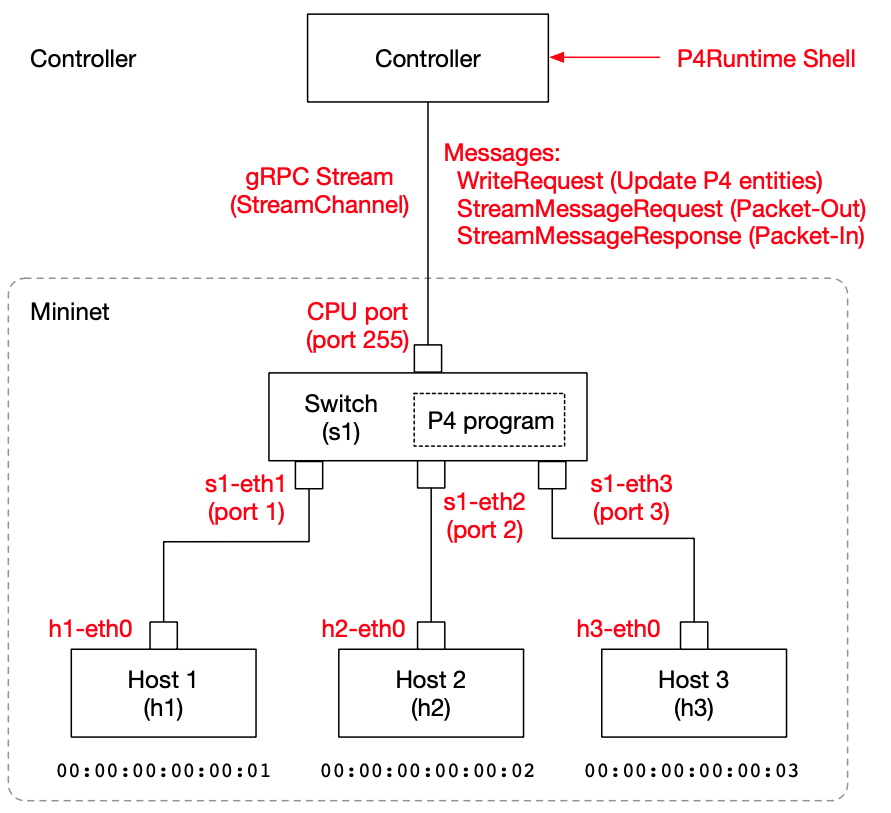

## Tutorial 0: Preparing the Environment

Each Tutorial contains a compiled p4info.txt file. If you want to compile your own P4 switch program, give it the P4 Runtime-enabled option:

```bash
root@f53fc79201b8:/tmp# p4c --target bmv2 --arch v1model --p4runtime-files p4info.txt nanosw01.p4 
root@f53fc79201b8:/tmp# ls
nanosw01.json  nanosw01.p4  nanosw01.p4i  p4info.txt
root@f53fc79201b8:/tmp# 
```

You will launch the P4Runtime Shell later using the generated p4info.txt and nanosw01.json.

### Preparing the switch (starting the Mininet environment)

#### System Structure

Here is the system configuration of this experiment.



#### Launching the Mininet Environment

We will use [P4 Runtime-enabled Mininet Docker Image](https://hub.docker.com/r/opennetworking/p4mn) as our switch. Here's how to get started.

Start the Mininet environment that supports P4Runtime in the Docker environment. Note that the --arp and --mac options are specified at startup so that ping tests can be performed without ARP processing.

```bash
$ docker run --privileged --rm -it -p 50001:50001 opennetworking/p4mn --arp --topo single,3 --mac
(snip...)
*** Starting CLI:
mininet> 
```
You can see that port 1 of s1 is connected to h1, port 2 is connected to h2, and port 3 is connected to h3.

```bash
mininet> net
h1 h1-eth0:s1-eth1
h2 h2-eth0:s1-eth2
h3 h3-eth0:s1-eth3
s1 lo:  s1-eth1:h1-eth0 s1-eth2:h2-eth0 s1-eth3:h3-eth0
mininet> 
```
The MAC address of interface h1-eth0, where h1 is connected to the switch, is 00:00:00:00:00:01. Similarly, h2 is 00:00:00:00:00:02 and h3 is 00:00:00:00:00:03.

### Connecting P4 Runtime Shell to Mininet

#### Building P4Runtime Shell dev version

For the experiments in this tutorial, use [p4runtime shell](https://github.com/p4lang/p4runtime-shell) Docker Image built using Dockerfile.dev.

```bash
$ git clone https://github.com/p4lang/p4runtime-shell.git
Cloning into 'p4runtime-shell'...
remote: Enumerating objects: 50, done.
(snip...)
Resolving deltas: 100% (101/101), done.
$ cd p4runtime-shell/
$ docker build -t myproj/p4rt-sh-dev -f Dockerfile.dev .
Sending build context to Docker daemon  372.2kB
Step 1/7 : FROM p4lang/p4runtime-sh:latest
(snip...)
Successfully built 5ddb6ed47ba8
Successfully tagged myproj/p4rt-sh-dev:latest
$ docker images
REPOSITORY            TAG                 IMAGE ID            CREATED             SIZE
myproj/p4rt-sh-dev    latest              5ddb6ed47ba8        23 seconds ago      285MB
```
After building, start it as follows.
```bash
$ docker run -it -v /tmp/P4runtime-nanoswitch/:/tmp/ myproj/p4rt-sh-dev /bin/bash
root@d633c64bbb3c:/p4runtime-sh# source $VENV/bin/activate
(venv) root@d633c64bbb3c:/p4runtime-sh# 
```
Note that the host's /tmp/P4runtime-nanoswitch directory is synchronized with docker's /tmp. And don't forget that the ```source $VENV/bin/activate``` process above is important for the next operation.

### Connecting to Mininet

Connect to Mininet as follows. Adjust the IP address to your environment. It's a good idea to make sure that simple commands like ```tables``` work.

```bash
(venv) root@d633c64bbb3c:/p4runtime-sh# cd /tmp/nanosw01
(venv) root@d633c64bbb3c:/tmp/nanosw01# /p4runtime-sh/p4runtime-sh --grpc-addr 192.168.XX.XX:50001 --device-id 1 --election-id 0,1 --config p4info.txt,nanosw01.json
*** Welcome to the IPython shell for P4Runtime ***
P4Runtime sh >>> tables
MyIngress.l2_match_table

P4Runtime sh >>> 
```

We're all set.


## Next Step

#### Tutorial 1: [NanoSwitch01](t1_nanosw01.md)

