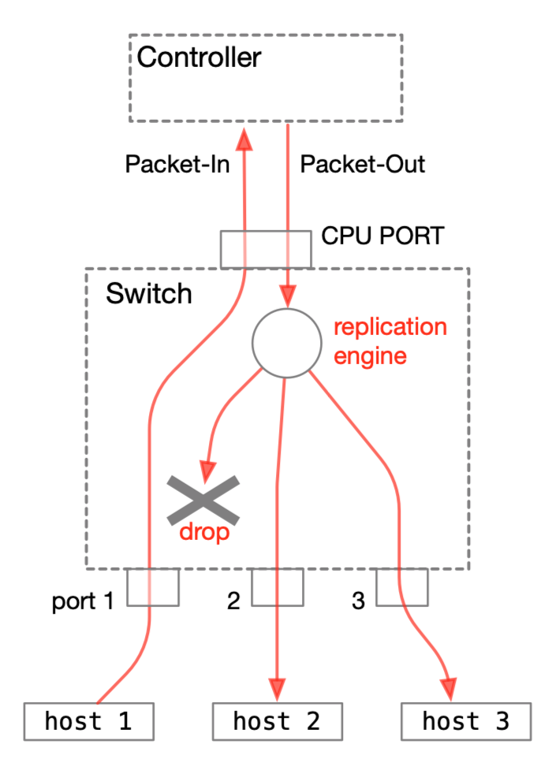

## Tutorial 3: NanoSwitch03

The switch tested here handles unknown hosts by creating a flow table on the switch side. To process the registration of entries into the flow table, we add some functionality to the controller (P4Runtime Shell).

### Experiment

#### Operations on the P4Runtime Shell side

Exit the P4Runtime Shell once, and then restart it using the nanosw03 switch program.

```python
P4Runtime sh >>> exit
$ docker run -ti -v /tmp/P4runtime-nanoswitch:/tmp p4lang/p4runtime-sh --grpc-addr 192.168.1.2:50001 --device-id 1 --election-id 0,1 --config /tmp/nanosw03/p4info.txt,/tmp/nanosw03/nanosw03.json
*** Welcome to the IPython shell for P4Runtime ***
P4Runtime sh >>> 
```

After that, start the controller program tutorial.py located under /tmp/nanosw03 as follows.

```python
P4Runtime sh >>> import sys

P4Runtime sh >>> sys.path.append "/tmp/nanosw03"

P4Runtime sh >>> import tutorial

P4Runtime sh >>> tutorial.controller_daemon(packet_in, tutorial.my_packetin)
```

#### Operations on the Mininet side

When you send a ping request again here, you can confirm that a ping reply is returned as before.

```bash
mininet> h1 ping -c 1 h2       <<<<<< send a single ping from h1 to h2
PING 10.0.0.2 (10.0.0.2) 56(84) bytes of data.
64 bytes from 10.0.0.2: icmp_seq=1 ttl=64 time=6.23 ms

--- 10.0.0.2 ping statistics ---
1 packets transmitted, 1 received, 0% packet loss, time 0ms
rtt min/avg/max/mdev = 6.233/6.233/6.233/0.000 ms
mininet> 
```

The monitoring results for each port are shown below. It can be seen that unnecessary packet reflection is suppressed here as well.

#####  h1 (s1-eth1)

```bash
12:30:55.734450 IP 10.0.0.1 > 10.0.0.2: ICMP echo request, id 129, seq 1, length 64
12:30:55.740638 IP 10.0.0.2 > 10.0.0.1: ICMP echo reply, id 129, seq 1, length 64
```

##### h2 (s1-eth2)

```bash
12:30:55.738186 IP 10.0.0.1 > 10.0.0.2: ICMP echo request, id 129, seq 1, length 64
12:30:55.738210 IP 10.0.0.2 > 10.0.0.1: ICMP echo reply, id 129, seq 1, length 64
```

##### h3 (s1-eth3)

```bash
12:30:55.738150 IP 10.0.0.1 > 10.0.0.2: ICMP echo request, id 129, seq 1, length 64
12:30:55.740679 IP 10.0.0.2 > 10.0.0.1: ICMP echo reply, id 129, seq 1, length 64
```

#### P4 RuntimeShell screen

At this time, you can confirm that output like the following is displayed. It can be seen that both packets in the round trip are processed as Packet-In.

```bash
P4Runtime sh >>> tutorial.controller_daemon(packet_in, tutorial.my_packetin)

packet-in: dst=00:00:00:00:00:02 src=00:00:00:00:00:01 port=1    <<<< processing of the first packet
send 
 payload: "\x00\x00\x00\x00\x00\x02\x00\x00\x00\x00\x00\x01\x08\x00\x45\x00\x00\x54\x99\xea\x40\x00\x40\x01\x8c\xbc\x0a\x00\x00\x01\x0a\x00\x00\x02\x08\x00\x74\x49\x00\xa1\x00\x01\x70\xcc\xe0\x69\x00\x00\x00\x00\x64\x0b\x0f\x00\x00\x00\x00\x00\x10\x11\x12\x13\x14\x15\x16\x17\x18\x19\x1a\x1b\x1c\x1d\x1e\x1f\x20\x21\x22\x23\x24\x25\x26\x27\x28\x29\x2a\x2b\x2c\x2d\x2e\x2f\x30\x31\x32\x33\x34\x35\x36\x37"
metadata {
  metadata_id: 1 ("egress_port")
  value: "\x00\x01"
}
metadata {
  metadata_id: 2 ("_pad")
  value: "\x00"
}
metadata {
  metadata_id: 3 ("mcast_grp")
  value: "\x00\x01"
}


packet-in: dst=00:00:00:00:00:01 src=00:00:00:00:00:02 port=2    <<<< processing of the second packet
send 
 payload: "\x00\x00\x00\x00\x00\x01\x00\x00\x00\x00\x00\x02\x08\x00\x45\x00\x00\x54\xfc\xbf\x00\x00\x40\x01\x69\xe7\x0a\x00\x00\x02\x0a\x00\x00\x01\x00\x00\x7c\x49\x00\xa1\x00\x01\x70\xcc\xe0\x69\x00\x00\x00\x00\x64\x0b\x0f\x00\x00\x00\x00\x00\x10\x11\x12\x13\x14\x15\x16\x17\x18\x19\x1a\x1b\x1c\x1d\x1e\x1f\x20\x21\x22\x23\x24\x25\x26\x27\x28\x29\x2a\x2b\x2c\x2d\x2e\x2f\x30\x31\x32\x33\x34\x35\x36\x37"
metadata {
  metadata_id: 1 ("egress_port")
  value: "\x00\x02"
}
metadata {
  metadata_id: 2 ("_pad")
  value: "\x00"
}
metadata {
  metadata_id: 3 ("mcast_grp")
  value: "\x00\x01"
}

^C                <<<< interrupt with Control-C
P4Runtime sh >>>
```

Next, we explain the packet behavior in this experiment.

### Packet Behavior

#### Overview

This switch floods all received packets to other ports via the controller. The figure below shows how a packet sent from host 1 is delivered to host 2 and host 3 via the controller.



Now we explain in a bit more detail.

1. A packet sent from host 1 is output as Packet-In to the controller
2. The controller sets MulticastGroup id 1 and sends it as Packet-Out
3. The switch receives it from CPU_PORT, replicates it as multicast, and outputs it
4. However, packets that would be output to the same port as the original ingress port (port 1) are dropped

To realize this behavior, several modifications were made to nanosw03.p4. We explain them following the packet flow.

#### Processing performed for Packet-In

The default_action of the l2_match_table is to_controller, and since the flow table is currently empty, all packets are sent to the controller as Packet-In. The flooding action is not used.

```C++
    action to_controller() {
        standard_metadata.egress_spec = CPU_PORT;
        hdr.packet_in.setValid();
        hdr.packet_in.ingress_port = standard_metadata.ingress_port;
    }
    table l2_match_table {
        key = {
            hdr.ethernet.dstAddr: exact;
            hdr.ethernet.srcAddr: exact;
        }
        actions = {
            forward;
            to_controller;
            // flooding;
        }
        size = 1024;
        default_action = to_controller;
    }
```

This Packet-In processing is implemented in the shell.py that was replaced earlier. Only the main parts are shown below.

```Python
def my_packetin(pin):
    global macTable
    payload = pin.packet.payload # packet body
    dstMac = payload[0:6]
    srcMac = payload[6:12]
    port = pin.packet.metadata[0].value
    print("\npacket-in: dst={0} src={1} port={2}"
          .format(mac2str(dstMac), mac2str(srcMac), int.from_bytes(port,'big')))
    mcast_grp = '0x0001'
    out_port = str(int.from_bytes(port,'big'))
    my_packetout(out_port, mcast_grp, payload)

def controller_daemon(packet_in, my_packetin=None, args=None):
    if my_packetin is None:
        while True:
            try:
                print(packet_in.packet_in_queue.get(block=True))
            except KeyboardInterrupt:
                break
    else:
        while True:
            try:
                pin = packet_in.packet_in_queue.get(block=True)
                my_packetin(pin)
            except KeyboardInterrupt:
                break
```

In other words, the packet_in.packet_in_queue.get() function waits for a StreamMessage Response, and when it receives one, it calls the my_packetin() function with the received Packet-In packet as an argument.

The my_packetin() function unconditionally attaches Multicast Group information (1) and the original ingress_port information to the received packet and passes it to the my_packetout() function.

#### Behavior related to Packet-Out

The implementation of the packet_out header and the my_packetout() function is shown below. Multicast Group information is added to the packet_out header.

```C++
@controller_header("packet_out")
header packet_out_header_t {
    bit<9> egress_port;
    bit<7> _pad;
    bit<16> mcast_grp; 
}
```

```python
def my_packetout(port, mcast_grp, payload):
    packet = PacketOut(payload)
    packet.metadata['egress_port'] = port
    packet.metadata['mcast_grp'] = mcast_grp
    packet.send()
    print('send \n', packet)
```

The my_packetout() function simply sets the packet_out header and sends it to the switch.

#### Ingress processing on the switch for received packets

To react to the added packet_out header, that is, mcast_grp, the Packet-Out processing in nanosw03.p4 has been modified.

Originally, it was written as follows. That is, if it was a Packet-Out (a packet coming from CPU_PORT), it simply outputs to the specified packet_out.egress_port.

```C++
            standard_metadata.egress_spec = hdr.packet_out.egress_port;
            hdr.packet_out.setInvalid();
```

This part is rewritten as follows.

```C++
            if (hdr.packet_out.mcast_grp == 0) { // packet out to specified port
                standard_metadata.egress_spec = hdr.packet_out.egress_port;
            } else { // broadcast to all port, or flood except specified port
                standard_metadata.mcast_grp = hdr.packet_out.mcast_grp; // set multicast flag
                meta.ingress_port = hdr.packet_out.egress_port; // store exception port
            }
            hdr.packet_out.setInvalid();
```

For this purpose, the following user metadata is defined.

```C
struct metadata {
    bit<9> ingress_port;
    bit<7> _pad;
}
```

In summary:

- If there is no Multicast Group specified in Packet-Out (0),
  - the output destination is packet_out.egress_port
- If a Multicast Group is specified,
  - it is set as the multicast output destination
  - and the port to be excluded (packet_out.egress_port) is stored in user metadata meta.ingress_port

Especially the last processing is important and somewhat tricky. (Sorry, I wanted to save fields. If you want to verify the behavior, read the note below.)

As a result, packets are replicated to all ports by the Replication Engine, and Egress processing is applied to each.

#### Egress processing on the switch

The Egress processing is simple. If the output destination is the excluded port set above, the packet is simply dropped. Otherwise, it is output as is.

```C
        if(meta.ingress_port == standard_metadata.egress_port) {
            mark_to_drop(standard_metadata);
        }
```


## Phew...

In this tutorial, we tried cooperative operation with the controller via Packet-In/Out. Of course, doing this results in very poor switch performance. In the next tutorial, we will create a switch that properly adds flow entries corresponding to hosts and enables packet exchange without involving the controller.


### Note: Experimenting with Packet-Out processing

As described above, the setting of Multicast Group and egress_port for Packet-Out processing in this switch is somewhat tricky.

- To output to port 3:
  - set hdr.packet_out.egress_port to 3
  - set hdr.packet_out.mcast_grp to 0 (default value is 0)
- To output to all ports except port 3 (flooding):
  - set hdr.packet_out.egress_port to 3
  - set hdr.packet_out.mcast_grp to 1

It may be easier to understand by actually checking the behavior, but the test is not very simple, so it is not described here.

#### 

## Next Step

#### Tutorial 4: [NanoSwitch04](t4_nanosw04.md)
