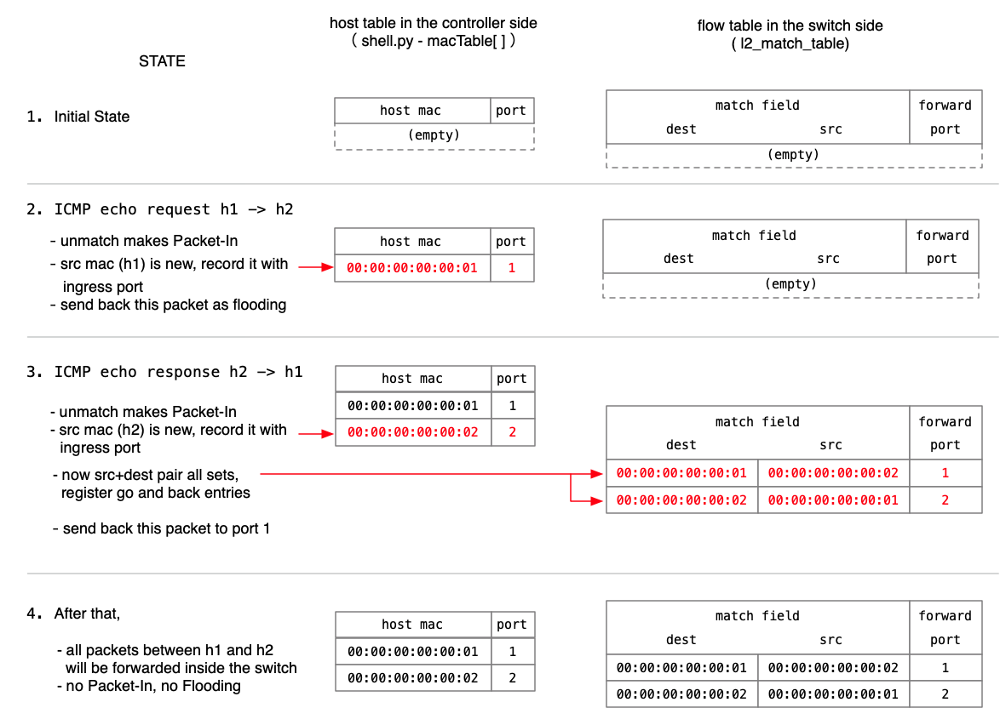

## Tutorial 4: NanoSwitch04

Create a host table on the controller side to handle known hosts. In other words, for communication between known host pairs, entries for both directions are added to the flow table. After that, packet forwarding in both directions is handled by the switch alone without involving the controller.

###  For those who want to skip ahead and start here

To run this test, the following steps are required.

1. Start P4Runtime Shell and connect to Mininet - see; Tutorial 0: [Preparing the Environment](./t0_prepare.md)
2. Configure Multicast Group - see; Tutorial 1: [NanoSwitch01](./t1_nanosw01.md)  
   Without this, flooding will not occur. Since no visible error occurs, it may be difficult to understand why it does not work.

### Experiment

#### Operations on the P4Runtime Shell side

This time there are no changes to the switch program, and the same nanosw03 switch program is used, but tutorial.py from the nanosw04 directory is used.

First, exit the P4Runtime Shell, and restart it using the nanosw03 switch program under nanosw04.

```python
P4Runtime sh >>> exit
$ docker run -ti -v /tmp/P4runtime-nanoswitch:/tmp p4lang/p4runtime-sh --grpc-addr 192.168.1.2:50001 --device-id 1 --election-id 0,1 --config /tmp/nanosw04/p4info.txt,/tmp/nanosw04/nanosw03.json
*** Welcome to the IPython shell for P4Runtime ***
P4Runtime sh >>>
```

After that, start the controller program tutorial.py located under /tmp/nanosw04 as follows.

```python
P4Runtime sh >>> import sys

P4Runtime sh >>> sys.path.append "/tmp/nanosw04"

P4Runtime sh >>> import tutorial

P4Runtime sh >>> tutorial.controller_daemon(packet_in, tutorial.my_packetin)
```

#### Operations on the Mininet side

When you send a ping request again here, you can confirm that a ping reply is returned as before.

```bash
mininet> h1 ping h2
PING 10.0.0.2 (10.0.0.2) 56(84) bytes of data.
64 bytes from 10.0.0.2: icmp_seq=1 ttl=64 time=8.38 ms
64 bytes from 10.0.0.2: icmp_seq=2 ttl=64 time=0.701 ms
64 bytes from 10.0.0.2: icmp_seq=3 ttl=64 time=0.778 ms
64 bytes from 10.0.0.2: icmp_seq=4 ttl=64 time=1.13 ms
^C
--- 10.0.0.2 ping statistics ---
4 packets transmitted, 4 received, 0% packet loss, time 3055ms
rtt min/avg/max/mdev = 0.535/0.772/1.114/0.221 ms
mininet> 
```

#### P4 RuntimeShell screen

At this time, you can confirm that output like the following is displayed. The first two packets are returned to the controller as Packet-In, and after flow entries are set during the processing of the second Packet-In, no further Packet-In processing occurs.

```bash
P4Runtime sh >>> tutorial.controller_daemon(packet_in, tutorial.my_packetin)

packet-in: dst=00:00:00:00:00:02 src=00:00:00:00:00:01 port=1
send 
 payload: "\x00\x00\x00\x00\x00\x02\x00\x00\x00\x00\x00\x01\x08\x00\x45\x00\x00\x54\x45\x25\x40\x00\x40\x01\xe1\x81\x0a\x00\x00\x01\x0a\x00\x00\x02\x08\x00\x93\xe7\x00\xa6\x00\x01\x14\x82\xe1\x69\x00\x00\x00\x00\xa6\xb2\x08\x00\x00\x00\x00\x00\x10\x11\x12\x13\x14\x15\x16\x17\x18\x19\x1a\x1b\x1c\x1d\x1e\x1f\x20\x21\x22\x23\x24\x25\x26\x27\x28\x29\x2a\x2b\x2c\x2d\x2e\x2f\x30\x31\x32\x33\x34\x35\x36\x37"
metadata {
  metadata_id: 1 ("egress_port")
  value: "\x00\x01"
}
metadata {
  metadata_id: 2 ("_pad")
  value: "\x00"
}
metadata {
  metadata_id: 3 ("mcast_grp")
  value: "\x00\x01"
}


packet-in: dst=00:00:00:00:00:01 src=00:00:00:00:00:02 port=2
send 
 payload: "\x00\x00\x00\x00\x00\x01\x00\x00\x00\x00\x00\x02\x08\x00\x45\x00\x00\x54\x2e\x29\x00\x00\x40\x01\x38\x7e\x0a\x00\x00\x02\x0a\x00\x00\x01\x00\x00\x9b\xe7\x00\xa6\x00\x01\x14\x82\xe1\x69\x00\x00\x00\x00\xa6\xb2\x08\x00\x00\x00\x00\x00\x10\x11\x12\x13\x14\x15\x16\x17\x18\x19\x1a\x1b\x1c\x1d\x1e\x1f\x20\x21\x22\x23\x24\x25\x26\x27\x28\x29\x2a\x2b\x2c\x2d\x2e\x2f\x30\x31\x32\x33\x34\x35\x36\x37"
metadata {
  metadata_id: 1 ("egress_port")
  value: "\x00\x01"
}
metadata {
  metadata_id: 2 ("_pad")
  value: "\x00"
}
metadata {
  metadata_id: 3 ("mcast_grp")
  value: "\x00\x00"
}

^C  <<<< subsequent ping packets are not processed as Packet-In (interrupted with Control-C)
Nothing (returned None)

P4Runtime sh >>> 
```

#### Table contents

You can check the flow entries registered in l2_match_table as follows. You can see that two entries are registered.

```Python
P4Runtime sh >>> table_entry["MyIngress.l2_match_table"].read(lambda te: print(te))
table_id: 33609159 ("MyIngress.l2_match_table")
match {                                 <<<< entry for h2 -> h1
  field_id: 1 ("hdr.ethernet.dstAddr")
  exact {
    value: "\x01"        <<<< destination is "00:00:00:00:00:01" and
  }
}
match {
  field_id: 2 ("hdr.ethernet.srcAddr")
  exact {
    value: "\x02"        <<<< source is "00:00:00:00:00:02"
  }
}
action {
  action {
    action_id: 16838673 ("MyIngress.forward")  <<<< call forward function
    params {
      param_id: 1 ("port")
      value: "\x01"        <<<< set 1 as the output port argument of forward
    }
  }
}

table_id: 33609159 ("MyIngress.l2_match_table")
match {                                 <<<< entry for h1 -> h2
  field_id: 1 ("hdr.ethernet.dstAddr")
  exact {
    value: "\x02"        <<<< destination is "00:00:00:00:00:02" and
  }
}
match {
  field_id: 2 ("hdr.ethernet.srcAddr")
  exact {
    value: "\x01"        <<<< source is "00:00:00:00:00:01"
  }
}
action {
  action {
    action_id: 16838673 ("MyIngress.forward")  <<<< call forward function
    params {
      param_id: 1 ("port")
      value: "\x02"        <<<< set 2 as the output port argument of forward
    }
  }
}

P4Runtime sh >>>

<<<< It is a good idea to delete the table contents as follows and observe the behavior again.
P4Runtime sh >>> table_entry["MyIngress.l2_match_table"].read(lambda a: a.delete())

```

### Packet exchanges and flow table contents

Below, we explain in more detail the packet exchanges and internal processing.

To realize this processing, the controller maintains a table of host MAC addresses and the port numbers to which they are connected (variable name macTable). We call this the host table. The table on the switch side, l2_match_table, is called the flow table.

First, the states of the two tables at each step are shown below.


The details are explained below.

#### 1. Initial State

In the initial state, both the host table and the flow table are empty.

```python
macTable = {}
```

| dstAddr | srcAddr | port |
| ------- | ------- | ---- |
|         |         |      |

#### 2. h1 -> h2 : ICMP Echo Request

The first packet does not match any pattern in the flow table, so it is sent as Packet-In. The controller that receives this performs the following processing.

1. The source address h1 is "Unknown", meaning it is not in the host table, so it is recorded in the host table along with its ingress port (port 1).
2. The destination address h2 is also "Unknown", so nothing can be done.
3. This packet is sent as Packet-Out with flooding specified.

```python
macTable = { "00:00:00:00:00:01": 1 }
```

| dstAddr | srcAddr | port |
| ------- | ------- | ---- |
|         |         |      |

#### 3. h2 -> h1 : ICMP Echo reply

Due to flooding, the Echo Request reaches h2, and h2 sends a reply to h1. However, this packet also does not match any pattern in the flow table, so it is sent as Packet-In. The controller that receives this performs the following processing.

1. The source h2 is "Unknown", so it is recorded in the host table along with its ingress port (port 2).
3. The destination h1 is "Already known", meaning it already exists in the host table, and it is clear that it should be sent to port 1. Since both destination and source information are now available, entries for both directions are added to the flow table.
4. This packet is sent as Packet-Out to port 1.

```python
macTable = { "00:00:00:00:00:01": 1,
             "00:00:00:00:00:02": 2 }
```

| dstAddr | srcAddr | port |
| ------- | ------- | ---- |
| 00:00:00:00:00:01 | 00:00:00:00:00:02 | 1 |
| 00:00:00:00:00:02 | 00:00:00:00:00:01 | 2 |

#### 4. after that....

After this, all communication between h1 and h2 is forwarded by the switch alone without involving the controller. No Packet-In or flooding occurs.


### Related code

This time, the same nanosw03.p4 switch program as in Tutorial 3 is used. The difference from Tutorial 3 is only on the controller side, namely tutorial.py.

#### tutorial.py

The packetin_process() function, which plays the most important role in this version, is shown below. It implements the packet exchanges between h1 and h2 and the corresponding internal processing described above.

```python
def my_packetin(pin):
    global macTable
    payload = pin.packet.payload
    dstMac = payload[0:6]
    srcMac = payload[6:12]
    port = pin.packet.metadata[0].value

    print("\npacket-in: dst={0} src={1} port={2}"
          .format(mac2str(dstMac), mac2str(srcMac), int.from_bytes(port,'big')))

    if dstMac == b'\xff\xff\xff\xff\xff\xff':  # broadcast
        print('broadcast')
    else:  # unicast
        if srcMac not in macTable:
            macTable[srcMac] = port
        if dstMac in macTable:
            insertFlowEntry(dstMac, srcMac, macTable[dstMac])
            insertFlowEntry(srcMac, dstMac, macTable[srcMac])
            out_port = str(int.from_bytes(macTable[dstMac],'big'))
            mcast_grp = '0x0000'
        else:
            out_port = str(int.from_bytes(port,'big'))
            mcast_grp = FLOOD_GRP
        my_packetout(out_port, mcast_grp, payload)
```

The insertFlowEntry() function called from the packetin_process() function above is also defined in shell.py.

```python
def insertFlowEntry(dstMac, srcMac, port):
    req = p4runtime_pb2.WriteRequest()
    update = req.updates.add()
    update.type = p4runtime_pb2.Update.INSERT

    table_entry = update.entity.table_entry
    table_entry.table_id = context.get_obj_id(P4Type.table, "MyIngress.l2_match_table")

    m1 = p4runtime_pb2.FieldMatch()
    m1.field_id = context.get_mf_id("MyIngress.l2_match_table", "hdr.ethernet.dstAddr")
    m1.exact.value = dstMac
    m2 = p4runtime_pb2.FieldMatch()
    m2.field_id = context.get_mf_id("MyIngress.l2_match_table", "hdr.ethernet.srcAddr")
    m2.exact.value = srcMac
    table_entry.match.extend([m1, m2])

    action = table_entry.action.action
    action.action_id = context.get_obj_id(P4Type.action, "MyIngress.forward")
    param = p4runtime_pb2.Action.Param()
    param.param_id = context.get_param_id("MyIngress.forward", "port")
    param.value = port
    action.params.append(param)

    client.write(req)
```


## Next Step

#### Tutorial 5: [NanoSwitch05](t5_nanosw05.md)
